# End-to-End Business Process (From Rough to Sale)
## Diamond Company Processing Workflow

---

## 1. HIGH-LEVEL OVERVIEW

```mermaid
flowchart LR
    A["🔷 Rough Stone\nReceived"] --> B["📋 Create Work\nOrder"]
    B --> C["✂️ Cut &\nPolish"]
    C --> D["🔍 Grade 4Cs\n(GIA Standards)"]
    D --> E["💰 Compute Price &\nCertify"]
    E --> F["📦 Add to Inventory\nAVAILABLE"]
    F --> G["👥 Customer\nOrder"]
    G --> H["🔒 Reserve\nStone"]
    H --> I["💳 Payment &\nShipment"]
    I --> J["✅ Mark SOLD &\nSnapshot"]
    
    style A fill:#e1f5ff
    style B fill:#fff3e0
    style C fill:#f3e5f5
    style D fill:#e8f5e9
    style E fill:#fce4ec
    style F fill:#f1f8e9
    style G fill:#e0f2f1
    style H fill:#fbe9e7
    style I fill:#f0f4c3
    style J fill:#c8e6c9
```



---

## 2. DETAILED PROCESS PHASES

### **PHASE 1: ROUGH STONE PROCUREMENT**

#### Step 1.1: Receive Rough Stone
```
Input: Rough diamond from supplier
Activity:
  - Supplier delivers rough diamond
  - Physical inspection for damage
  - Record receipt in system
  
SQL Operations:
  INSERT INTO ROUGH_STONES (
    supplier_id, received_date, weight_carat, cost_usd, status
  ) VALUES (?, CURRENT_DATE(), ?, ?, 'RECEIVED')
  
Outputs:
  - rough_id assigned
  - Status: RECEIVED
  - Cost basis recorded
  
Key Validation:
  - Supplier must exist in SUPPLIERS
  - Weight must be > 0 carat
  - Cost must be >= 0
```

#### Step 1.2: Assign to Employee & Create Work Order
```
Input: rough_id, employee_id
Activity:
  - Assign cutting work to skilled polisher
  - Create work order with timeline
  - Update rough stone status
  
SQL Operations:
  UPDATE ROUGH_STONES 
  SET status = 'ASSIGNED' 
  WHERE rough_id = ?
  
  INSERT INTO WORK_ORDERS (
    rough_id, employee_id, start_date, status
  ) VALUES (?, ?, CURRENT_DATE(), 'OPEN')
  
Outputs:
  - work_order_id assigned
  - Rough stone status: ASSIGNED
  - Employee responsible for cutting
  
Business Rules:
  - Only one active work order per rough stone (UNIQUE constraint)
  - Employee must be active (is_active = TRUE)
  - Timeline must be realistic (validated in application)
```

---

### **PHASE 2: DIAMOND PROCESSING (CUTTING & POLISHING)**

#### Step 2.1: Cut and Polish Diamond
```
Input: work_order_id (physical cutting occurs)
Activity:
  - Master polisher cuts rough stone
  - Physical process takes days to weeks
  - Dimensions recorded (x, y, z, depth, table %)
  - Quality checked during process
  
System Updates:
  - Physical inspection logs (typically in separate system)
  - Update work order status to 'IN_PROGRESS'
  
SQL Operations:
  UPDATE WORK_ORDERS
  SET status = 'IN_PROGRESS'
  WHERE work_order_id = ?
  
Output:
  - work_order_id status: IN_PROGRESS
  - Diamond physically processed
  - Dimensions measured
  
Key Milestones:
  - Phase 1: Initial cutting (20-30% of time)
  - Phase 2: Detailed shaping (40-50% of time)
  - Phase 3: Polishing (20-40% of time)
  - Quality verification (continuous)
```

#### Step 2.2: Mark Cutting Complete
```
Input: work_order_id, (optional) end_date
Activity:
  - Final quality check after cutting
  - Dimensions finalized (x, y, z, depth %, table %)
  - Mark work order as DONE
  - Update rough stone status to CUT
  
SQL Operations:
  UPDATE WORK_ORDERS
  SET status = 'DONE', end_date = CURRENT_DATE()
  WHERE work_order_id = ?
  
  UPDATE ROUGH_STONES
  SET status = 'CUT'
  WHERE rough_id = ?
  
Outputs:
  - Rough stone status: CUT
  - Work order completed
  - Ready for grading phase
```

---

### **PHASE 3: GRADING & CERTIFICATION (4Cs)**

#### Step 3.1: Conduct 4Cs Grading
```
Input: rough_id (physical stone)
Activity:
  - Perform GIA-standard grading
  - Determine 4Cs (Carat, Cut, Color, Clarity)
  - Check weight precisely
  - Verify cut quality visually and by measurement
  - Assess color under controlled lighting
  - Examine clarity with 10x magnification
  - Create diamond record in system
  
Grading Output Details:

  Cut Grade: (GIA Scale)
    - Excellent (Ideal cut angles for light return)
    - Very Good (Excellent light return)
    - Good (Good light return)
    - Fair (Some light loss)
    - Poor (Significant light loss)
  
  Color Grade: (D-Z Scale)
    - D-F: Colorless (highest premium)
    - G-J: Near colorless
    - K-M: Faint color
    - N-R: Very light color
    - S-Z: Light color (lowest value)
  
  Clarity Grade: (GIA Scale)
    - FL: Flawless (no inclusions visible at 10x)
    - IF: Internally flawless (minor external features)
    - VVS1-VVS2: Very very slightly included (difficult to see at 10x)
    - VS1-VS2: Very slightly included (somewhat difficult to see)
    - SI1-SI2: Slightly included (easy to see at 10x)
    - I1-I3: Included (visible to unaided eye, I3 very obvious)
  
  Carat Weight: Precise to 2 decimal places
```

#### Step 3.2: Create Diamond Record
```
Input: rough_id, 4Cs grades, carat weight, dimensions
Activity:
  - Create DIAMONDS record with all grading data
  - Generate unique SKU (or assign manually)
  - Set base price per carat based on market data
  - Initialize status to AVAILABLE
  
SQL Operation:
  INSERT INTO DIAMONDS (
    sku, rough_id, carat, cut_grade, color_grade,
    clarity_grade, depth, table_pct, base_price_per_carat,
    status, created_at
  ) VALUES (
    CONCAT('SKU-', UUID()), ?, ?, ?, ?,
    ?, ?, ?, ?, 'AVAILABLE', CURRENT_TIMESTAMP
  )
  
Trigger Activated:
  - trg_diamonds_before_insert: Validates and auto-generates SKU
  
Outputs:
  - diamond_id assigned
  - SKU assigned (must be globally unique)
  - Status: AVAILABLE
```

#### Step 3.3: Compute Price (4Cs Multiplier Formula)
```
Input: diamond_id, 4Cs grades, base price per carat
Activity:
  - Apply GIA grading multipliers
  - Calculate final market price
  - Lock diamond for atomic calculation
  
Price Calculation Formula:
  
  price_usd = carat × base_price_per_carat × 
              cut_multiplier × color_multiplier × clarity_multiplier
  
  Example:
    carat = 1.50
    base_price_per_carat = 5000
    cut multiplier (Excellent) = 1.20
    color multiplier (D) = 1.30
    clarity multiplier (FL) = 1.55
    
    price = 1.50 × 5000 × 1.20 × 1.30 × 1.55 = $18,135

SQL Operation (within REPEATABLE READ transaction):
  1. SELECT diamond data FOR UPDATE (lock row)
  2. SELECT multipliers FROM CUT, COLOR, CLARITY FOR SHARE (read-lock)
  3. CALCULATE price
  4. UPDATE DIAMONDS SET price_usd = ? WHERE diamond_id = ?
  5. COMMIT
  
Stored Procedure: sp_compute_price()
  - Handles deadlock retry logic (max 3 retries with exponential backoff)
  - Proper transaction isolation
  - Atomic operation
  
Outputs:
  - price_usd calculated and stored
  - Diamond ready for inventory/sale
```

#### Step 3.4: Certification (Optional but Recommended)
```
Input: diamond_id (optional: external GIA cert number)
Activity:
  - Submit diamond for formal GIA certification (if not already done)
  - Receive certification document and number
  - Record in system
  
SQL Operation:
  UPDATE DIAMONDS
  SET certified = TRUE, 
      certification_number = ?, 
      updated_at = CURRENT_TIMESTAMP
  WHERE diamond_id = ?
  
Trigger: trg_diamonds_after_update
  - Logs certification change to AUDIT_LOG
  
Business Rules:
  - Only diamonds of significant value certified (>$1000 typical)
  - External GIA database reference
  - Certification adds 5-15% premium to market price (not auto-applied)
```

---

### **PHASE 4: INVENTORY MANAGEMENT**

#### Step 4.1: Add to Available Inventory
```
Input: diamond_id (created and priced in Phase 3)
Activity:
  - Diamond automatically available for sale after pricing
  - Status is already 'AVAILABLE' from creation
  - System tracks in inventory reports
  
Status: AVAILABLE
  - Can be ordered by customers
  - Appears in search/browsing functions
  - Price publicly listed
  
SQL Queries for Inventory:
  -- Find available diamonds under price
  SELECT * FROM DIAMONDS
  WHERE status = 'AVAILABLE' AND price_usd < ?
  ORDER BY price_usd DESC
  LIMIT 10
  
  -- Count by color and clarity
  SELECT color_grade, clarity_grade, COUNT(*) as count
  FROM DIAMONDS
  WHERE status = 'AVAILABLE'
  GROUP BY color_grade, clarity_grade
  
Outputs:
  - Diamond appears in search results
  - Customer can place order
```

#### Step 4.2: Daily Inventory Snapshot
```
Input: snapshot_date (default = TODAY)
Activity:
  - Create daily snapshot of inventory status
  - Useful for analytics and inventory tracking
  - Records how many diamonds in each status
  - Calculates total inventory value
  
SQL Operation (called daily, e.g., via scheduled job):
  INSERT INTO INVENTORY_SNAPSHOT (
    snapshot_date, total_available, total_reserved, total_sold,
    total_value_usd, total_cost_usd
  )
  SELECT
    CURRENT_DATE(),
    SUM(CASE WHEN status = 'AVAILABLE' THEN 1 ELSE 0 END),
    SUM(CASE WHEN status = 'RESERVED' THEN 1 ELSE 0 END),
    SUM(CASE WHEN status = 'SOLD' THEN 1 ELSE 0 END),
    SUM(price_usd),
    SUM(cost_usd)
  FROM DIAMONDS d
  LEFT JOIN ROUGH_STONES rs ON d.rough_id = rs.rough_id
  
Stored Procedure: sp_create_inventory_snapshot()
  - Called as scheduled job (e.g., 11:59 PM daily)
  - Deadlock retry logic included
  - Prevents duplicate snapshots for same date
  
Outputs:
  - Historical inventory data
  - Useful for trend analysis
  - Reports and dashboards
```

---

### **PHASE 5: ORDER PROCESSING**

#### Step 5.1: Customer Places Order
```
Input: customer_id, diamond_id, (payment method)
Activity:
  - Customer selects diamond from inventory
  - Place order through website/system
  - Trigger order processing workflow
  
Pre-Conditions:
  - Customer must exist in CUSTOMERS table
  - Diamond must have status = 'AVAILABLE'
  - Price must be valid
  
Decision Point: Is Diamond Available?
  
  ✅ YES (status = 'AVAILABLE')
    → Proceed to Step 5.2
  
  ❌ NO (status = 'RESERVED' or 'SOLD')
    → Return error: "Diamond not available"
    → Suggest alternative diamonds
    → Cancel order request
  
Error Scenarios:
  - Customer not found: SIGNAL SQLSTATE '45000'
  - Diamond not found: SIGNAL SQLSTATE '45000'
  - Diamond already sold: Return user-friendly error
  - System timeout: Retry with exponential backoff (max 3 retries)
```

#### Step 5.2: Atomically Create Order & Reserve Diamond
```
Input: customer_id, diamond_id
Activity:
  - Create order record
  - Create order item (line item)
  - Reserve diamond (change status to RESERVED)
  - Lock all related rows atomically
  
SQL Transaction (REPEATABLE READ isolation):
  START TRANSACTION
  
  1. Lock diamond:
     SELECT status FROM DIAMONDS 
     WHERE diamond_id = ? FOR UPDATE
     
     IF status != 'AVAILABLE' THEN
       ROLLBACK and return error
  
  2. Create order:
     INSERT INTO ORDERS (customer_id, order_date, status, total_amount)
     VALUES (?, CURRENT_DATE(), 'PENDING', ?)
     SET order_id = LAST_INSERT_ID()
  
  3. Create order item:
     INSERT INTO ORDER_ITEMS (order_id, diamond_id, price_at_sale, quantity)
     VALUES (?, ?, ?, 1)
  
  4. Update diamond status:
     UPDATE DIAMONDS 
     SET status = 'RESERVED', updated_at = CURRENT_TIMESTAMP
     WHERE diamond_id = ?
  
  5. Update order total:
     UPDATE ORDERS
     SET total_amount = (SELECT SUM(price_at_sale) FROM ORDER_ITEMS WHERE order_id = ?)
     WHERE order_id = ?
  
  COMMIT
  
Stored Procedure: sp_place_order()
  - Handles all above atomically
  - Deadlock retry logic (max 3 retries)
  - Exponential backoff: 0.1s, 0.2s, 0.3s
  - Returns: order_id, success flag, error message
  
Lock Order (Critical for Deadlock Prevention):
  1. DIAMONDS (write lock first)
  2. ORDERS (write lock)
  3. ORDER_ITEMS (write lock)
  4. No other table locks in this operation
  
Status Changes:
  - Diamond: AVAILABLE → RESERVED
  - Order: (new) PENDING
  
Outputs:
  - order_id assigned
  - order_date set to today
  - total_amount calculated
  - Diamond locked for this customer
```

#### Step 5.3: Decision: Proceed with Payment?
```
Decision Tree:

  Order Created (status = PENDING)
  
  ├─ YES: Proceed to Payment ─→ Step 5.4
  │
  ├─ NO: Cancel Order ─→ Step 5.5 (Cancellation)
  │
  └─ TIMEOUT: Release Lock ─→ Step 5.5 (Auto-cancellation)


Timeout Behavior:
  - If payment not completed within 24 hours
  - Automatic cancellation triggered
  - Diamond status reverted to AVAILABLE
  - Customer notified
```

#### Step 5.4: Mark Order as PAID & Ship
```
Input: order_id, (shipping details)
Activity:
  1. Process payment (external payment gateway)
  2. Mark order as PAID in system
  3. Generate shipping label
  4. Mark order as SHIPPED
  5. Mark diamond as SOLD
  
SQL Transactions:

  UPDATE ORDERS SET status = 'PAID' WHERE order_id = ?
  
  [External: Generate shipping label, package diamond]
  
  Then:
  
  START TRANSACTION (REPEATABLE READ)
  
  1. Lock order:
     UPDATE ORDERS 
     SET status = 'SHIPPED', updated_at = CURRENT_TIMESTAMP
     WHERE order_id = ?
  
  2. Get diamond_id:
     SELECT diamond_id FROM ORDER_ITEMS 
     WHERE order_id = ? FOR UPDATE
  
  3. Update diamond status:
     UPDATE DIAMONDS 
     SET status = 'SOLD', updated_at = CURRENT_TIMESTAMP
     WHERE diamond_id = ?
  
  4. Create audit entry (automatic via trigger)
  
  COMMIT
  
Stored Procedure: sp_fulfill_order()
  - Atomic SHIPPED + diamond SOLD update
  - Handles all error cases
  - Deadlock retry logic
  
Status Changes:
  - Order: PENDING → PAID → SHIPPED
  - Diamond: RESERVED → SOLD
  
Outputs:
  - Order marked shipped
  - Diamond marked sold (no longer in inventory)
  - Tracking number provided to customer
```

#### Step 5.5: Cancel Order (Revert Diamond to Available)
```
Cancellation Triggers:
  1. Customer requests cancellation (before payment)
  2. Payment fails/declined
  3. 24-hour timeout on PENDING order
  4. Inventory sync finds conflict
  
SQL Transaction:

  START TRANSACTION (REPEATABLE READ)
  
  1. Get diamond_id:
     SELECT diamond_id FROM ORDER_ITEMS 
     WHERE order_id = ? FOR UPDATE
  
  2. Update order status:
     UPDATE ORDERS 
     SET status = 'CANCELLED', updated_at = CURRENT_TIMESTAMP
     WHERE order_id = ?
  
  3. Revert diamond to AVAILABLE:
     UPDATE DIAMONDS 
     SET status = 'AVAILABLE', updated_at = CURRENT_TIMESTAMP
     WHERE diamond_id = ?
  
  4. Create audit entry (automatic via trigger)
  
  COMMIT
  
Business Rules:
  - Non-destructive operation (no deletions)
  - Full audit trail maintained
  - Diamond available for other customers
  - Order record preserved for reporting
  
Outputs:
  - Order status: CANCELLED
  - Diamond status: AVAILABLE
  - Refund processed (external system)
```

---

### **PHASE 6: POST-SALE ACTIVITIES**

#### Step 6.1: Update Inventory Snapshot
```
Input: Current date/time
Activity:
  - Called at end of business day
  - Captures final inventory state
  - Useful for closing daily sales
  - Tracks profitability metrics
  
SQL Operation (Stored Procedure: sp_create_inventory_snapshot):
  INSERT INTO INVENTORY_SNAPSHOT (...)
  SELECT summary data FROM DIAMONDS, ROUGH_STONES
  
Reports Generated:
  - Daily inventory value
  - Units sold today
  - Revenue metrics
  - Margin analysis
```

#### Step 6.2: Audit & Compliance Review
```
Input: Timestamp range (e.g., last 7 days)
Activity:
  - Review AUDIT_LOG for all transactions
  - Verify no unauthorized changes
  - Check for data inconsistencies
  - Compliance reporting
  
Query:
  SELECT * FROM AUDIT_LOG
  WHERE changed_at BETWEEN ? AND ?
  ORDER BY changed_at DESC
  
Key Audit Checks:
  - Diamond price never decreased (business rule)
  - No unauthorized status changes
  - All deletions logged (if any)
  - Customer data sensitive: audit all updates
  - Order changes: verify authorization
```

---

## 3. ERROR HANDLING & ROLLBACK SCENARIOS

### **Scenario 1: Deadlock During Order Placement**
```
Event: Two customers order same diamond simultaneously

Initial State:
  Diamond A status = AVAILABLE

Timeline:
  09:00:00 - Transaction 1 begins: SELECT diamond A FOR UPDATE
  09:00:00 - Transaction 2 begins: SELECT diamond A FOR UPDATE
  09:00:01 - Transaction 1 tries to INSERT order (locks ORDER table)
  09:00:02 - Transaction 2 tries to INSERT order (waits on ORDER table)
  09:00:03 - Transaction 1 tries to INSERT order_item (deadlock detected!)
  
Deadlock Detection:
  MySQL detects circular lock dependency
  Throws error: ERROR 1213 (40P01): Deadlock found
  
System Response (sp_place_order):
  1. CATCH exception (ERROR 1213)
  2. ROLLBACK transaction 1
  3. v_retry_count++
  4. SLEEP(0.1 * v_retry_count) seconds
  5. Retry from beginning (goto retry_loop)
  
Resolution:
  - Transaction 1 retries and succeeds (Transaction 2 finished)
  - Transaction 2 fails with "Diamond not available" (expected behavior)
  
Prevention Measures:
  - Consistent lock order: DIAMONDS → ORDERS → ORDER_ITEMS
  - Proper indexes on frequently locked columns
  - Short transaction duration
  - Use REPEATABLE READ isolation level
```

### **Scenario 2: Cascading Cancellation**
```
Event: Customer cancels order after payment processing started

Initial State:
  Order A: PENDING
  Diamond X: status = RESERVED (reserved for this order)
  Payment: Processing...
  
Timeline:
  10:00:00 - Payment processor: "Payment declined (insufficient funds)"
  10:00:01 - System receives decline notification
  10:00:02 - sp_fulfill_order receives p_new_status = 'CANCELLED'
  
SQL Transaction:
  1. Lock ORDER A
  2. Lock DIAMOND X (which is RESERVED)
  3. UPDATE DIAMOND X SET status = 'AVAILABLE'
  4. UPDATE ORDER A SET status = 'CANCELLED'
  5. COMMIT
  
Results:
  - Order A: CANCELLED
  - Diamond X: AVAILABLE (available for others again)
  - Refund initiated (external system)
  - Customer notified
  - Audit log created automatically (trigger)
  
Business Impact:
  - Diamond back in inventory within seconds
  - No revenue lost (payment was declined anyway)
  - Transparent history maintained
```

### **Scenario 3: Stale Data / Race Condition**
```
Event: Inconsistent read between inventory check and purchase

Timeline:
  09:00:00 - Customer A: Queries available diamonds, sees Diamond Y
  09:00:05 - Customer B: Orders Diamond Y (succeeds)
  09:00:06 - Customer A: Tries to order Diamond Y (fails - already RESERVED)
  
Trigger: REPEATABLE READ isolation level
  - Customer A has consistent snapshot from 09:00:00
  - At 09:00:06, when trying to order, row lock reveals status is RESERVED
  - Order creation blocked
  - Error message: "Diamond is no longer available"
  
Prevented By:
  - REPEATABLE READ: Ensures consistent view
  - Row-level locks: Prevents dirty reads
  - Trigger validation: Defends against direct SQL
  
Customer Experience:
  - Quick error message ("Already reserved")
  - Suggestion: "View similar diamonds..."
  - No silent failure
```

---

## 4. CRITICAL BUSINESS RULES

| Rule | Enforcement Level | Implementation |
|---|---|---|
| Each diamond can be ordered only once | Database Constraint | UNIQUE (order_id, diamond_id) in ORDER_ITEMS |
| Only AVAILABLE diamonds can be ordered | Transaction Logic | SELECT ... FOR UPDATE with IF check |
| Diamond price cannot be NULL | Column Constraint | NOT NULL, DEFAULT 0 |
| Carat weight must be positive | Check Constraint | CHECK (carat > 0) |
| Color grade must be D-Z | Check Constraint | CHECK (color BETWEEN 'D' AND 'Z') |
| Rough stone cannot be deleted if diamonds created | Foreign Key | CONSTRAINT fk_d_rough |
| Order items cascade-delete with order | Foreign Key | ON DELETE CASCADE |
| Audit log is immutable | Application Logic | No UPDATE/DELETE triggers |
| Only one active work order per rough stone | Unique Constraint | UNIQUE (rough_id, status) |
| Employee must be active to receive work | Index + Query Filter | idx_active_role + WHERE is_active = TRUE |

---

## 5. MONITORING & TROUBLESHOOTING

### **Key Metrics to Monitor**

```sql
-- Average order completion time
SELECT 
  AVG(DATEDIFF(updated_at, created_at)) as avg_days_to_complete
FROM ORDERS
WHERE status = 'SHIPPED'

-- Deadlock frequency
SELECT COUNT(*) as deadlock_count
FROM AUDIT_LOG
WHERE payload LIKE '%deadlock%'
GROUP BY DATE(changed_at)

-- Diamond inventory health
SELECT 
  DATE(snapshot_date) as date,
  total_available, total_reserved, total_sold,
  total_value_usd
FROM INVENTORY_SNAPSHOT
ORDER BY snapshot_date DESC
LIMIT 30

-- Cancellation rate
SELECT 
  COUNT(*) as total_orders,
  SUM(CASE WHEN status = 'CANCELLED' THEN 1 ELSE 0 END) as cancellations,
  ROUND(100 * SUM(CASE WHEN status = 'CANCELLED' THEN 1 ELSE 0 END) / COUNT(*), 2) as cancellation_rate
FROM ORDERS
WHERE created_at >= DATE_SUB(CURRENT_DATE(), INTERVAL 30 DAY)
```

---

## 6. IMPLEMENTATION CHECKLIST

- [ ] Reference tables populated (CUT, COLOR, CLARITY)
- [ ] Sample suppliers created
- [ ] Sample employees created  
- [ ] All improved stored procedures deployed
- [ ] All improved triggers deployed
- [ ] CSV diamond data imported (if applicable)
- [ ] Daily snapshot job scheduled (recommended: 11:59 PM)
- [ ] Audit log monitoring enabled
- [ ] Deadlock monitoring set up
- [ ] Connection pooling configured (recommended: 20-50 connections)
- [ ] Backup strategy established
- [ ] Testing completed (see Testing Guide)

---


