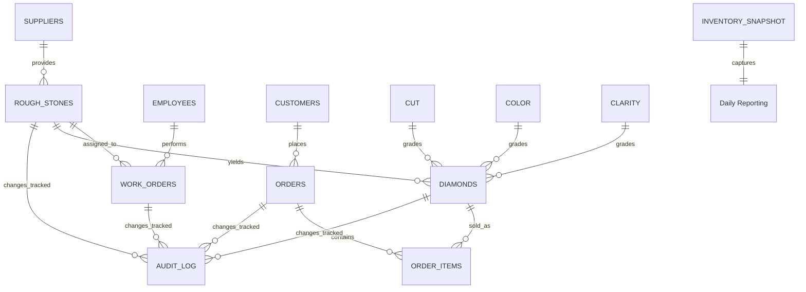

# Entity-Relationship Diagram (ERD) - Diamond Company Database

## Visual ERD (Mermaid)

## Relationship Details

### 1. **Reference Tables** (Lookup/Domain Values)

#### CUT Table
- **Primary Key**: `Grade` (ENUM: Excellent, Very Good, Good, Fair, Poor)
- **Attributes**: 
  - `Grade`: GIA cut grade classification
  - `multiplier`: Price multiplier (0-2.0 range)
- **Purpose**: Stores cut grade reference values used in price calculations
- **Cardinality**: One-to-Many with DIAMONDS (one cut grade, many diamonds)
- **Relationship Type**: Master-Detail (reference data)

#### COLOR Table
- **Primary Key**: `Grade` (CHAR(1): D-Z)
- **Attributes**:
  - `Grade`: GIA color grade (D=colorless to Z=light)
  - `multiplier`: Price multiplier
- **Purpose**: Color grading reference for diamonds
- **Cardinality**: One-to-Many with DIAMONDS
- **Relationship Type**: Master-Detail (reference data)

#### CLARITY Table
- **Primary Key**: `Grade` (ENUM: FL, IF, VVS1, VVS2, VS1, VS2, SI1, SI2, I1, I2, I3)
- **Attributes**:
  - `Grade`: GIA clarity grade (FL=flawless to I3=included)
  - `multiplier`: Price multiplier
- **Purpose**: Clarity grading reference
- **Cardinality**: One-to-Many with DIAMONDS
- **Relationship Type**: Master-Detail (reference data)

### 2. **Independent Tables** (No Foreign Key Dependencies)

#### SUPPLIERS Table
- **Primary Key**: `supplier_id` (INT AUTO_INCREMENT)
- **Unique Keys**: `uk_name_country` (name, country)
- **Attributes**:
  - `supplier_id`: Unique identifier
  - `name`: Supplier company name (VARCHAR 120)
  - `country`: Country of origin (VARCHAR 80)
  - `contact_email`: Contact email (VARCHAR 120)
  - `created_at`: Timestamp
- **Purpose**: Track rough diamond suppliers
- **Cardinality**: One-to-Many with ROUGH_STONES
- **Indexes**: PRIMARY KEY, uk_name_country

#### EMPLOYEES Table
- **Primary Key**: `employee_id` (INT AUTO_INCREMENT)
- **Attributes**:
  - `employee_id`: Unique identifier
  - `full_name`: Employee name (VARCHAR 120)
  - `role`: Job role (VARCHAR 60) - e.g., "Polisher", "Grader"
  - `hire_date`: Employment start date
  - `is_active`: Active status flag
  - `created_at`: Timestamp
- **Purpose**: Store employee information for work assignment
- **Cardinality**: One-to-Many with WORK_ORDERS
- **Indexes**: PRIMARY KEY, idx_active_role

#### CUSTOMERS Table
- **Primary Key**: `customer_id` (INT AUTO_INCREMENT)
- **Unique Keys**: `email`
- **Attributes**:
  - `customer_id`: Unique identifier
  - `full_name`: Customer name (VARCHAR 120)
  - `email`: Email address (VARCHAR 120)
  - `phone`: Phone number (VARCHAR 40)
  - `created_at`: Timestamp
- **Purpose**: Customer information for orders
- **Cardinality**: One-to-Many with ORDERS
- **Indexes**: PRIMARY KEY, uk_email, idx_created_at

### 3. **Processing Tables** (Linked to Reference Tables)

#### ROUGH_STONES Table
- **Primary Key**: `rough_id` (INT AUTO_INCREMENT)
- **Foreign Keys**: 
  - `supplier_id` → SUPPLIERS (required)
- **Attributes**:
  - `rough_id`: Unique stone identifier
  - `supplier_id`: Source supplier
  - `received_date`: Receipt date
  - `weight_carat`: Stone weight (DECIMAL 8,3)
  - `cost_usd`: Supplier cost (DECIMAL 12,2)
  - `status`: ENUM (RECEIVED, ASSIGNED, CUT, REJECTED)
  - `created_at`, `updated_at`: Timestamps
- **Purpose**: Raw diamond inventory tracking
- **Cardinality**: 
  - Many-to-One with SUPPLIERS (many rough stones per supplier)
  - One-to-Many with DIAMONDS (one rough stone yields one or more diamonds)
  - One-to-Many with WORK_ORDERS
- **Constraints**: CHECK (weight_carat > 0), CHECK (cost_usd >= 0)
- **Indexes**: idx_status, idx_received_date, idx_supplier_status, PRIMARY KEY

#### WORK_ORDERS Table
- **Primary Key**: `work_order_id` (INT AUTO_INCREMENT)
- **Foreign Keys**:
  - `rough_id` → ROUGH_STONES (required)
  - `employee_id` → EMPLOYEES (required)
- **Attributes**:
  - `work_order_id`: Unique order identifier
  - `rough_id`: Rough stone being worked on
  - `employee_id`: Assigned employee
  - `start_date`: Work start date
  - `end_date`: Work completion date (nullable)
  - `status`: ENUM (OPEN, IN_PROGRESS, DONE, CANCELLED)
  - `created_at`, `updated_at`: Timestamps
- **Purpose**: Track diamond cutting and polishing work
- **Cardinality**:
  - Many-to-One with ROUGH_STONES
  - Many-to-One with EMPLOYEES
- **Unique Constraints**: `uk_rough_pending` (rough_id, status) - ensures only one active work order per stone
- **Indexes**: PRIMARY KEY, idx_status, idx_rough_id, idx_employee_id, idx_rough_status
- **Purpose of unique constraint**: Deadlock prevention - prevents concurrent modifications

### 4. **Core Transaction Table**

#### DIAMONDS Table (Critical for Deadlock Prevention)
- **Primary Key**: `diamond_id` (INT AUTO_INCREMENT)
- **Unique Keys**: `sku` (SKU-*)
- **Foreign Keys**:
  - `rough_id` → ROUGH_STONES (required)
  - `cut_grade` → CUT (optional - set during grading)
  - `color_grade` → COLOR (required)
  - `clarity_grade` → CLARITY (required)
- **Attributes**:
  - `diamond_id`: Unique identifier
  - `sku`: Stock keeping unit (globally unique)
  - `rough_id`: Source rough stone
  - `carat`: Weight in carats (DECIMAL 5,2)
  - `cut_grade`: GIA cut (ENUM or NULL)
  - `color_grade`: GIA color (CHAR(1), D-Z)
  - `clarity_grade`: GIA clarity (ENUM)
  - `depth`: Depth percentage (nullable)
  - `table_pct`: Table percentage (nullable)
  - `status`: ENUM (AVAILABLE, RESERVED, SOLD)
  - `base_price_per_carat`: Price per carat (DECIMAL 10,2)
  - `price_usd`: Final computed price (DECIMAL 12,2)
  - `certified`: Boolean certification flag
  - `certification_number`: GIA cert number (VARCHAR 64)
  - `created_at`, `updated_at`: Timestamps
- **Purpose**: Finished diamond inventory for sale
- **Cardinality**: 
  - Many-to-One with ROUGH_STONES
  - One-to-Many with ORDER_ITEMS
- **Constraints**: 
  - CHECK (carat > 0)
  - CHECK (base_price_per_carat >= 0)
  - CHECK (price_usd >= 0)
  - CHECK (color_grade BETWEEN 'D' AND 'Z')
- **Comprehensive Indexes** (deadlock prevention):
  - PRIMARY KEY (diamond_id)
  - UNIQUE (sku)
  - idx_status (frequently filtered)
  - idx_available_price (composite for "show available diamonds under $X")
  - idx_status_created (for inventory snapshots)
  - idx_color_grade, idx_clarity_grade, idx_cut_grade (filtering by 4Cs)
  - idx_created_at (for reporting)
- **Critical for**: Deadlock prevention through strategic indexing

### 5. **Order Processing Tables**

#### ORDERS Table
- **Primary Key**: `order_id` (INT AUTO_INCREMENT)
- **Foreign Keys**:
  - `customer_id` → CUSTOMERS (required)
- **Attributes**:
  - `order_id`: Unique order identifier
  - `customer_id`: Customer placing order
  - `order_date`: Order placement date
  - `status`: ENUM (PENDING, PAID, SHIPPED, CANCELLED)
  - `total_amount`: Total order value (DECIMAL 12,2)
  - `created_at`, `updated_at`: Timestamps
- **Purpose**: Customer purchase orders
- **Cardinality**:
  - Many-to-One with CUSTOMERS
  - One-to-Many with ORDER_ITEMS
- **Indexes**: PRIMARY KEY, idx_customer_id, idx_status, idx_order_date, idx_customer_status
- **Lock Order**: Locked first in order fulfillment (prevents deadlocks)

#### ORDER_ITEMS Table
- **Primary Key**: `order_item_id` (INT AUTO_INCREMENT)
- **Foreign Keys**:
  - `order_id` → ORDERS (required, ON DELETE CASCADE)
  - `diamond_id` → DIAMONDS (required)
- **Unique Keys**: `uk_order_diamond` (order_id, diamond_id) - prevents duplicate items
- **Attributes**:
  - `order_item_id`: Line item identifier
  - `order_id`: Reference to order
  - `diamond_id`: Ordered diamond
  - `price_at_sale`: Price locked at order time (DECIMAL 12,2)
  - `quantity`: Quantity (typically 1 for diamonds)
  - `created_at`: Timestamp
- **Purpose**: Individual line items in orders
- **Cardinality**:
  - Many-to-One with ORDERS
  - Many-to-One with DIAMONDS
- **Constraints**: 
  - CHECK (price_at_sale >= 0)
  - CHECK (quantity > 0)
  - CASCADE DELETE on orders
- **Indexes**: PRIMARY KEY, idx_order_id, idx_diamond_id, uk_order_diamond
- **Lock Order**: Locked second (after ORDERS, before DIAMONDS)

### 6. **Audit and Reporting Tables**

#### AUDIT_LOG Table (Immutable)
- **Primary Key**: `audit_id` (BIGINT AUTO_INCREMENT)
- **Attributes**:
  - `audit_id`: Unique audit entry identifier
  - `table_name`: Table where change occurred (VARCHAR 64)
  - `action`: ENUM (INSERT, UPDATE, DELETE)
  - `row_id`: Primary key of affected row
  - `payload`: JSON with old/new values
  - `changed_by`: User or process name
  - `changed_at`: Timestamp of change
- **Purpose**: Complete audit trail for compliance and debugging
- **Cardinality**: Many-to-One (all tables log here)
- **Indexes**: 
  - PRIMARY KEY (audit_id)
  - idx_table_action (efficient filtering by table/action)
  - idx_changed_at (chronological queries)
  - idx_row_id (trace individual record changes)
- **Features**: 
  - Immutable table (no updates or deletes)
  - JSON payloads for flexible data capture
  - Triggered by all relevant tables
  - Essential for deadlock root cause analysis

#### INVENTORY_SNAPSHOT Table
- **Primary Key**: `snapshot_id` (INT AUTO_INCREMENT)
- **Unique Keys**: `snapshot_date`
- **Attributes**:
  - `snapshot_date`: Date of snapshot
  - `total_available`: Count of AVAILABLE diamonds
  - `total_reserved`: Count of RESERVED diamonds
  - `total_sold`: Count of SOLD diamonds
  - `total_value_usd`: Total inventory value
  - `total_cost_usd`: Total cost basis
  - `created_at`: Snapshot creation timestamp
- **Purpose**: Historical inventory tracking for reporting and analytics
- **Cardinality**: One-to-One with each day
- **Indexes**: PRIMARY KEY, uk_date, idx_created_at
- **Data Retention**: Permanent for historical analysis

## Relationship Locking Order (Deadlock Prevention)

**Critical for deadlock prevention - always lock in this order:**

1. **Reference tables** (CUT, COLOR, CLARITY) - locked for share (read-only)
2. **Independent tables** (SUPPLIERS, EMPLOYEES, CUSTOMERS) - can be in any order
3. **ROUGH_STONES** - locked for update before dependent tables
4. **WORK_ORDERS** - locked after ROUGH_STONES and EMPLOYEES
5. **DIAMONDS** - critical table, locked carefully to minimize hold time
6. **ORDERS** - locked before ORDER_ITEMS
7. **ORDER_ITEMS** - locked after ORDERS, before DIAMONDS
8. **AUDIT_LOG** - locked last (insert only, no conflicts)

## Key Design Principles

### 1. **Deadlock Prevention**
- Strategic index placement on frequently joined columns
- Consistent row-locking order in stored procedures
- Use of `FOR UPDATE` and `FOR SHARE` locks
- Transaction isolation level set to REPEATABLE READ
- Exponential backoff retry logic (0.1s * attempt_number)

### 2. **Data Integrity**
- Foreign key constraints with appropriate delete cascade
- CHECK constraints for value validation
- UNIQUE constraints to prevent duplicates
- NOT NULL where logically required
- DEFAULT values for audit timestamps

### 3. **Performance**
- Covering indexes for common queries
- Composite indexes for multi-column filters
- Indexed foreign keys (MySQL requirement)
- Separate tables for 4Cs multipliers (normalization)

### 4. **Auditability**
- Comprehensive AUDIT_LOG with JSON payloads
- Timestamps on all major tables
- User/process tracking on changes
- Immutable audit records

## Sample Access Patterns & Their Indexes

| Access Pattern | Query | Required Index |
|---|---|---|
| Find available diamonds under price | `WHERE status = 'AVAILABLE' AND price_usd < X` | idx_available_price |
| List by 4Cs | `WHERE color_grade = 'D' AND clarity_grade = 'FL'` | idx_color_grade, idx_clarity_grade |
| Recent additions | `WHERE created_at > NOW() - INTERVAL 7 DAY` | idx_created_at |
| Inventory daily | `SELECT * FROM INVENTORY_SNAPSHOT WHERE snapshot_date = ?` | PRIMARY KEY |
| Audit trail | `WHERE table_name = 'DIAMONDS' AND changed_at > ?` | idx_table_action, idx_changed_at |

## Normalization Analysis

- **First Normal Form (1NF)**: ✅ All atomic values, no repeating groups
- **Second Normal Form (2NF)**: ✅ All non-key attributes depend on entire primary key
- **Third Normal Form (3NF)**: ✅ No transitive dependencies (4Cs multipliers in separate tables)
- **Boyce-Codd Normal Form (BCNF)**: ✅ All determinants are candidate keys

---

